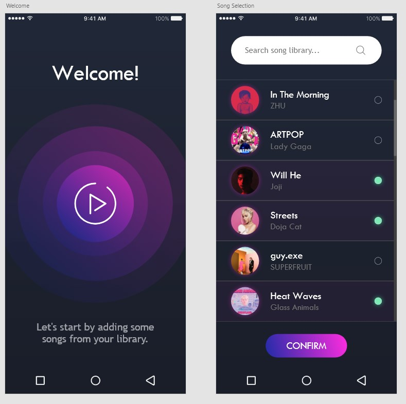

# AdobeXD Wireframe - Reverb
**Reverb** is an application with an idea to improve the music listening experience. With the ongoing rise in popularity of the *slowed-down/reverb* trope of song remixes, allowing the users to switch themselves between the standard and the slowed-down versions of the song would bring a new sort of enjoyment. 

Exploring music as a form of art should be easily accessible even to people who are not as technologically oriented. Therefore, intuitive interface design should be able to allow easily managing main parameters that would influence said experience (such as speed, bass, reverb, pitch change). 

The app is still in its idea development stage, however, I believe a great UI design would help bring the look and feel of the application closer to life. It is a starting step.

The wireframe design is made using **AdobeXD**.

## Tools Used

- AdobeXD 2020
- Adobe Illustrator 2020
- Adobe Photoshop 2020

## Resources

- [Icon pack](https://www.flaticon.com/packs/multimedia-collection)
- [Flaticon](https://www.flaticon.com/) - SVG/PNG icons
- [Unsplash](https://unsplash.com/) - Copyright free HD photos

## Screenshots

